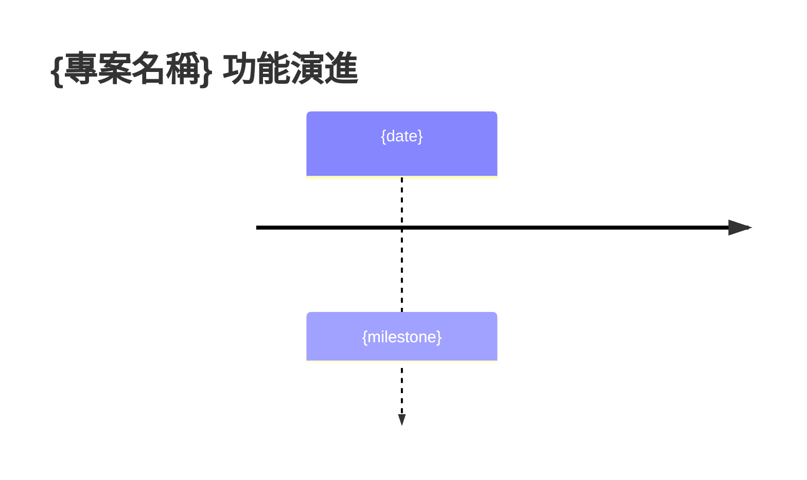

# Document Templates

Phase 3/5 產出的 9 個文件模板。每個陳述必須標注來源與信心度。

## 來源標記規則

- `[CODE: path/to/file:line]` — 來自程式碼
- `[GIT: hash]` — 來自 commit
- `[USER: Q{n}]` — 來自使用者回答
- `[INFER: 依據]` — 推斷，需標注依據

## 信心度標記

- 🟢 高：有直接程式碼證據 + 使用者確認
- 🟡 中：有程式碼證據但未經使用者確認，或使用者確認但無程式碼證據
- 🔴 低：純推斷，無直接證據

---

## 1. `constitution.md`

```markdown
# {專案名稱} Constitution

> 反向工程產出 | 基於 commit {HASH} | {DATE}

## Core Principles

### I. {原則名稱}
{描述}
- **證據**: [CODE: {path}] [GIT: {hash}] [USER: Q{n}]
- **信心度**: 🟢

### II. {原則名稱}
{描述}
- **證據**: [INFER: {依據}]
- **信心度**: 🟡

## Development Workflow
{從 CI/CD + 使用者回答}

## Quality Gates
{從 lint 設定 + 使用者回答}

## Governance
- 本 Constitution 由原始碼反向工程產出
- 所有 🟡🔴 標記項目建議由團隊審閱後正式批准

**Version**: 1.0.0-reverse-engineered | **Created**: {DATE}
```

---

## 2. `spec.md`

```markdown
# Feature Specification: {專案名稱}

**Created**: {DATE}
**Status**: Reverse-Engineered Draft
**Source**: 原始碼 + Git Log + 使用者確認

## User Scenarios & Testing

### User Story 1 - {Title} (Priority: P{n})

{描述}

**來源**:
- [CODE: {path}] — {說明}
- [GIT: {hash}] — {commit message}
- [USER: Q{n}] — {使用者補充}

**信心度**: 🟢

**Why this priority**: {依據} [USER: Q8]

**Independent Test**: {描述}

**Acceptance Scenarios**:
1. **Given** {前置}, **When** {動作}, **Then** {結果}
   - 來源: [CODE: {test_file:line}]

### Edge Cases
- {edge case} — [CODE: {error_handling_file:line}]
- {edge case} — [GIT: {fix_commit_hash}]

## Requirements

### Functional Requirements
- **FR-001**: {requirement} — [CODE: {file:line}] 🟢
- **FR-002**: {requirement} — [INFER: {依據}] 🟡

### Key Entities
- **{Entity}**: {描述} — [CODE: {model_file}]

## Success Criteria

### Measurable Outcomes
- **SC-001**: {指標} — [CODE: {config/test}] 🟢
- **SC-002**: {指標} — [USER: Q11] 🟢
- **SC-003**: {指標} — [INFER] 🔴 [KNOWN LIMITATION: 無法從程式碼驗證]

## Assumptions
- {假設} — [CODE: {.env.example}]
- {假設} — [USER: Q{n}]
```

---

## 3. `plan.md`

```markdown
# Implementation Plan: {專案名稱}

**Date**: {DATE} | **Spec**: [./spec.md](./spec.md)

## Summary
{整合 README + 使用者回答}

## Technical Context

| 項目 | 值 | 來源 | 信心度 |
|------|-----|------|-------|
| Language/Version | {value} | [CODE: {config_file}] | 🟢 |
| Primary Dependencies | {top 10} | [CODE: {lock_file}] | 🟢 |
| Storage | {db} | [CODE: {connection_config}] | 🟢 |
| Testing | {framework} | [CODE: {test_config}] | 🟢 |
| Target Platform | {platform} | [USER: Q12] | 🟢 |
| Project Type | {type} | [INFER: {依據}] | 🟡 |
| Performance Goals | {goals} | [USER: Q11] | 🟢 |

## Constitution Check
- [x] {原則} — 驗證於 [CODE: {file}]
- [ ] {原則} — [KNOWN LIMITATION: 無法從程式碼驗證]

## Project Structure
```text
{project_tree with 職責標注}
{每個目錄的職責來源: [USER: Q6] or [INFER]}
```

## Complexity Tracking

| 觀察 | 原因 | 建議 | 來源 |
|------|------|------|------|
| {觀察} | {原因} | {建議} | [GIT: {hash}] |
```

---

## 4. `data-model.md`

```markdown
# Data Model: {專案名稱}

**Source**: [CODE: {model_files}] + [USER: Q9]

## Entities

### {Entity Name} 🟢
- **來源**: [CODE: {path/to/model}]
- **使用者確認**: [USER: Q9]

| 欄位 | 型別 | 約束 | 說明 | 來源 |
|------|------|------|------|------|
| {field} | {type} | {constraint} | {desc} | [CODE: {file:line}] |

### {Entity Name 2} 🟡
- **來源**: [INFER: 從 migration 檔案推斷]

## Entity Relationships
```mermaid
erDiagram
    {diagram}
```

## 資料演進
| Migration | 日期 | 變更 | 來源 |
|-----------|------|------|------|
| {name} | {date} | {change} | [CODE: {migration_file}] |
```

---

## 5. `contracts/rest-api.md`

```markdown
# API Contracts: {專案名稱}

**Source**: [CODE: {route_files}] + [USER: Q10]

## REST Endpoints

| Method | Path | Handler | 描述 | 信心度 | 來源 |
|--------|------|---------|------|-------|------|
| {method} | {path} | {handler} | {desc} | 🟢 | [CODE: {file:line}] |

## Endpoint Details

### {Endpoint Name} 🟢

**Request**:
```json
{從 validation/type 提取}
```
- 來源: [CODE: {schema_file:line}]

**Response**:
```json
{從 serializer/response type 提取}
```
- 來源: [CODE: {response_file:line}]

**Error Responses**:
- `4xx`: {description} — [CODE: {error_handler:line}]
```

---

## 6. `contracts/events.md`

```markdown
# Event Contracts: {專案名稱}

> 若專案無事件機制，此檔案標記 N/A

| Event | Payload | Publisher | Subscriber | 來源 |
|-------|---------|-----------|------------|------|
```

---

## 7. `research.md`

```markdown
# Research: {專案名稱}

## 技術棧分析

| 類別 | 選擇 | 版本 | 來源 |
|------|------|------|------|
| {category} | {choice} | {ver} | [CODE: {config}] |

## 演進歷程

### 版本里程碑
| 版本 | 日期 | 重大變更 | Commits | 來源 |
|------|------|---------|---------|------|
| {tag} | {date} | {summary} | {hashes} | [GIT] |

### 功能演進時間線


## 核心模組分析

| 排名 | 檔案 | 變更次數 | Fix 次數 | 風險 | 來源 |
|------|------|---------|---------|------|------|
| {n} | {file} | {changes} | {fixes} | {risk} | [GIT] |

## 技術債分析

| 類型 | 數量 | 代表性項目 | 來源 |
|------|------|----------|------|
| TODO | {n} | {example} | [CODE: {file:line}] |
| FIXME | {n} | {example} | [CODE: {file:line}] |

## 使用者補充脈絡
{來自 Q13, Q14 的回答}
```

---

## 8. `tasks.md`

```markdown
# Tasks: {專案名稱} — 現有功能盤點

**Input**: spec.md + plan.md + 掃描資料

## Format: `[ID] [Status] [Story] Description`

- **[✅]**: 已實作（程式碼存在）[CODE: {path}]
- **[⚠️]**: 部分實作或有問題
- **[❌]**: 規格應有但缺失

---

## Phase 1: 基礎設施

- [✅] T001 [Infra] 專案結構 — [CODE: {path}]
- [✅] T002 [Infra] CI/CD — [CODE: {workflow}]
- [⚠️] T003 [Infra] {issue} — [GIT: {fix_commits}]

## Phase 2: User Story 1 - {Title} (P1) 🎯

- [✅] T010 [US1] {task} — [CODE: {file}]
- [⚠️] T011 [US1] {task} — {issue description}
- [❌] T012 [US1] {missing} — [USER: Q7 指出應有此功能]

## 缺口分析

| 缺口 | 嚴重度 | User Story | 來源 | 建議 |
|------|-------|------------|------|------|
| {gap} | 高/中/低 | US{n} | [USER: Q{n}] | {action} |
```

---

## 9. `quickstart.md`

```markdown
# Quickstart: {專案名稱}

**Source**: [CODE: README + Makefile + docker-compose] + [USER: Q12]

## 環境需求
{從設定檔提取}

## 安裝與啟動
{從 README / Makefile 提取}

## 驗證場景

### Scenario 1: {核心功能}
1. {步驟} — [CODE: {test_file}]
2. {步驟}
3. **預期結果**: {result}
```

---

## 10. `checklist.md`

```markdown
# Reverse-Engineering Checklist: {專案名稱}

**Created**: {DATE}

## 來源驗證
- [ ] CHK001 所有 User Story 有 [CODE] 或 [GIT] 來源標注
- [ ] CHK002 所有 FR 有 [CODE: file:line] 標注
- [ ] CHK003 技術棧與 lock file 一致
- [ ] CHK004 API 端點與路由定義交叉驗證
- [ ] CHK005 資料模型與 Schema/Migration 交叉驗證

## 使用者確認追蹤
- [ ] CHK006 Phase 1 所有問題已獲回答
- [ ] CHK007 Phase 4 所有 🔴 項目已處理
- [ ] CHK008 所有 [NEEDS CONFIRMATION] 已消除或轉為 [KNOWN LIMITATION]

## 完整性
- [ ] CHK009 所有入口點已識別
- [ ] CHK010 所有外部依賴已列於 research.md
- [ ] CHK011 Edge Cases 已從 fix commits 提取
- [ ] CHK012 所有 [USER: Q{n}] 引用可追溯至實際回答

## 品質
- [ ] CHK013 未包含 LLM 臆測的不存在功能
- [ ] CHK014 Mermaid 語法正確
- [ ] CHK015 所有檔案路徑在 codebase 中存在
- [ ] CHK016 敏感資訊已排除

## 信心度統計
- 🟢 高: {n} 項（）
- 🔴 低: {n} 項（{%}）
- 目標：🟢 > 70%，🔴 < 10%

## 人工審閱
- [ ] CHK017 領域專家確認 spec.md
- [ ] CHK018 架構師確認 constitution.md
- [ ] CHK019 開發者確認 tasks.md
- [ ] CHK020 所有文件間無矛盾
```
